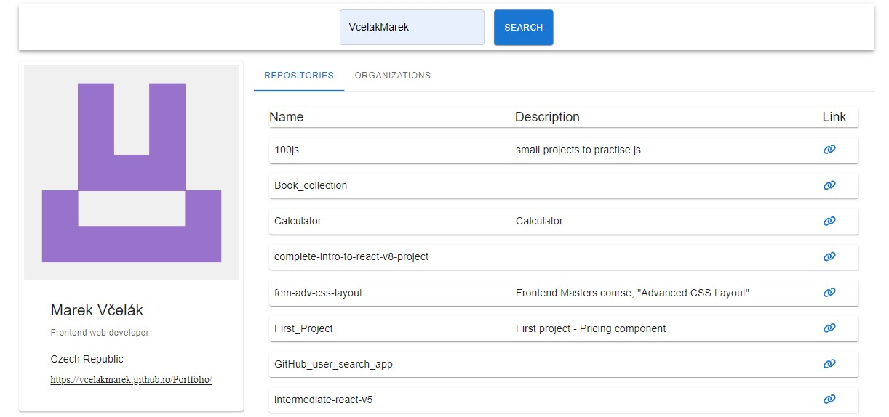

# GitHub Finder

This is a solution to the GitHub Finder challenge, created as part of a hiring process.

## Table of contents

- [Overview](#overview)
  - [The challenge](#the-challenge)
  - [Screenshot](#screenshot)
- [My process](#my-process)
  - [Built with](#built-with)
  - [What I learned](#what-i-learned)
- [Deployment](#deployment)
- [Author](#author)

## Overview

### The challenge

As part of the hiring process, the goal was to showcase proficiency in building a responsive GitHub user search application with specific requirements:

- Use functional components with hooks
- Ensure the app is responsive
- Utilize ES6 syntax, including arrow functions, destructuring, async/await, etc.
- Display a spinner (or similar) when information is fetching
- Incorporate a UI component library such as Material-UI (MUI) or Chakra UI
- Handle errors coming from the backend gracefully
- Add React Context if relevant, e.g., switching between light/dark mode
- Maintain a clean git history with meaningful commit messages
- Showcase common tools used in the daily development environment, including linters and code formatters
- Use types with TypeScript for improved code clarity and reliability

### Screenshot

## My process

### Built with

- [React](https://reactjs.org/) - JS library
- [Typescript](https://www.typescriptlang.org/) - programming language
- [Vite](https://vitejs.dev/) - Build tool
- [Prettier](https://prettier.io/) - Code formatter
- [ESLint](https://eslint.org/) - Syntax check
- [React Query](https://react-query.tanstack.com/) - Data fetching library
- [Axios](https://axios-http.com/) - HTTP client
- [Font Awesome Icons](https://fontawesome.com/) - Icon library
- [Material-UI (MUI)](https://mui.com/) - UI component library

### What I learned

- Usage of React Query for efficient data fetching
- Utilization of Material-UI (MUI) for creating UI
- Implementation of nested contexts in React for managing global state

## Deployment

The project is deployed on [GitHub Pages](https://vcelakmarek.github.io/Interview_Project/)

## Author

- GitHub - [Marek Vcelak](https://github.com/VcelakMarek)
- LinkedIn - [Marek Vcelak](https://www.linkedin.com/in/marek-v%C4%8Del%C3%A1k-6176bb1b0/)
